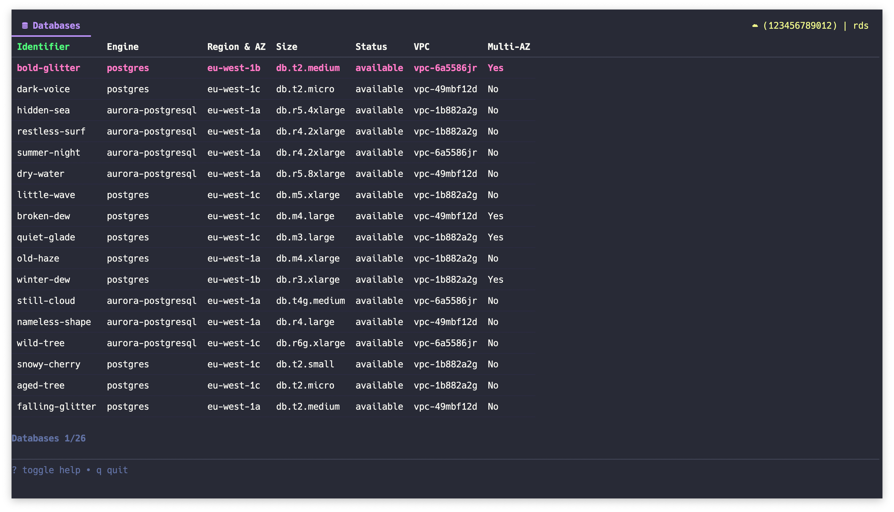
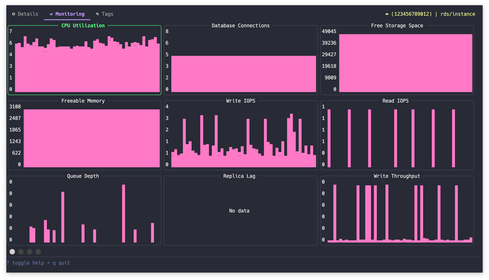
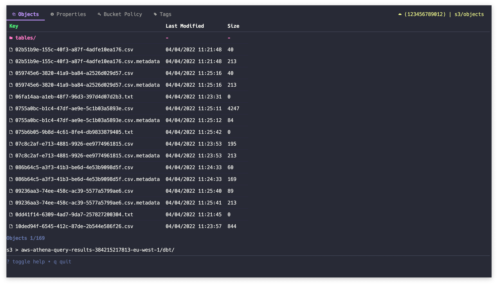
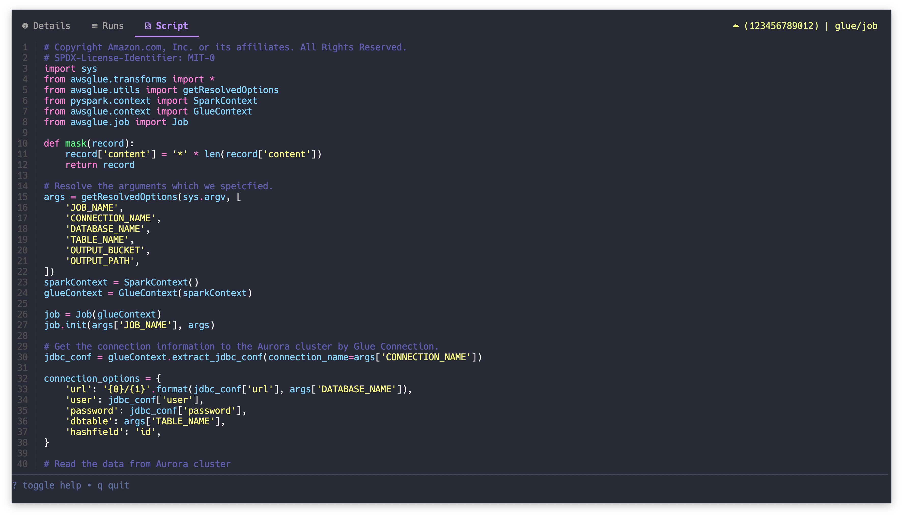

# sawsy

<p>
    <a href="https://github.com/danielcmessias/sawsy/releases"></a>
    <a href="https://github.com/danielcmessias/sawsy/actions"></a>
</p>

An AWS Console for your Terminal

*it's not just good, it's saucy!*







More cool things to come (maybe). Definitely need to add a GIF instead of a bunch of images here!

# Install

Brew:

```sh
brew tap danielcmessias/tap
brew install danielcmessias/tap/sawsy
```

Or download a [binary release](https://github.com/danielcmessias/sawsy/releases):

Or build it yourself:

```sh
go build
```

# Usage

Make sure you have AWS credentials set. Press `?` to toggle help$.

To switch services press `s`. You can launch directly to a particular service like

```sh
sawsy rds
```

# AWS Services Supported

I've started with the barebones of services that are useful to me. It's pretty
fast to add new views that just list tabular data. Beyond that takes some more work.

| Services | Status |
|---|---|
| Glue | Partially implemented |
| IAM | Partially implemented |
| Lake Formation | Partially implemented. |
| Lambda | Bare bones only. |
| RDS | Partially implemented. |
| S3 | Partially implemented. <br><br><em>Known issues:</em><br><ul><li>Only returns up to 1000 objects.</li></ul> |


# Issues

**Q: I don't see the fancy icons in the nav-bar**

**A:** You need a [font](https://www.nerdfonts.com/font-downloads) with icons and a terminal that supports it.

<details>
  <summary>Want to just hide the icons?</summary>

Create a new file `touch ~/.sawsy.yml` and add the following config:

```yaml
theme:
  showIcons: false 
```

This is the only config available for now.
</details>


**Q: The layout is behaving weird**

**A:** Try making your window bigger, it's buggy under a minimum size right now.


**Q: I don't like the colour scheme**

**A:** Bad luck, no customization yet. In the meanwhile you can jump on the [Dracula](https://draculatheme.com/) bandwagon.

**Q: Anything else?**
**A:** It's a bug. Issue reports welcome!

# Contributing

Yes please!

---

Built with [Bubble Tea](https://github.com/charmbracelet/bubbletea).

Credit to [gh-dash](https://github.com/dlvhdr/gh-dash) for the starting point!
