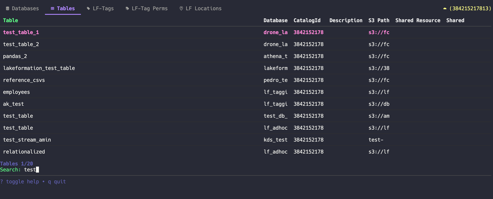
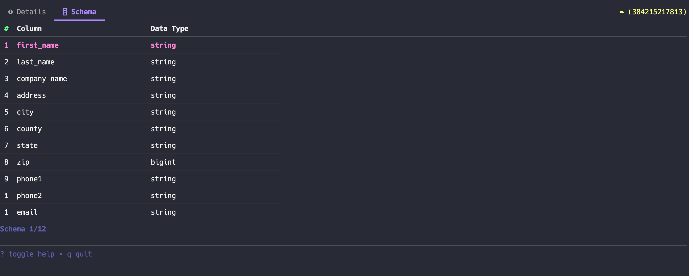

# lfq (Lake Formation Query)

An AWS Lake Formation Dashboard for your Terminal.




More cool things to come (maybe).

# Install

Brew:

```sh
brew tap danielcmessias/tap
brew install danielcmessias/tap/lfq
```

Or download a [binary release](https://github.com/danielcmessias/lfq/releases):

Or build it yourself:

```sh
go build
```

# Usage

Make sure you have AWS credentials set. Press `?` to toggle help.

# Issues

**Q: I don't see the fancy icons in the nav-bar**

**A:** You need a [font](https://www.nerdfonts.com/font-downloads) with icons and a terminal that supports it.


**Q: The layout is behaving weird**

**A:** Try making your window bigger, it's buggy under a minimum size right now.


**Q: I don't like the colour scheme**

**A:** Bad luck, no customization yet. In the meanwhile you can jump on the [Dracula](https://draculatheme.com/) bandwagon.

**Q: Anything else?**
**A:** It's a bug.

# Contributing

Yes please.

---

Built with [Bubble Tea](https://github.com/charmbracelet/bubbletea).

Credit to [gh-dash](https://github.com/dlvhdr/gh-dash) for the starting point!
